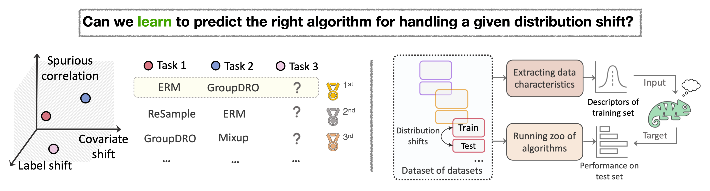
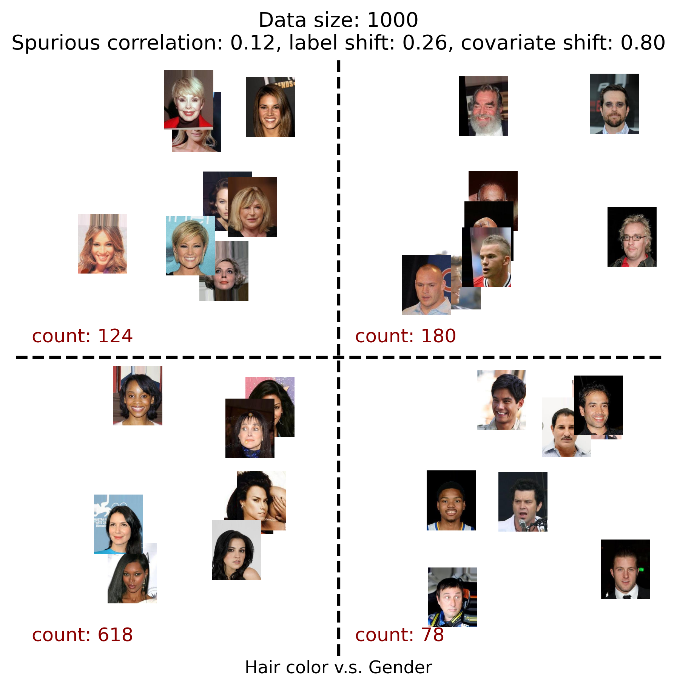
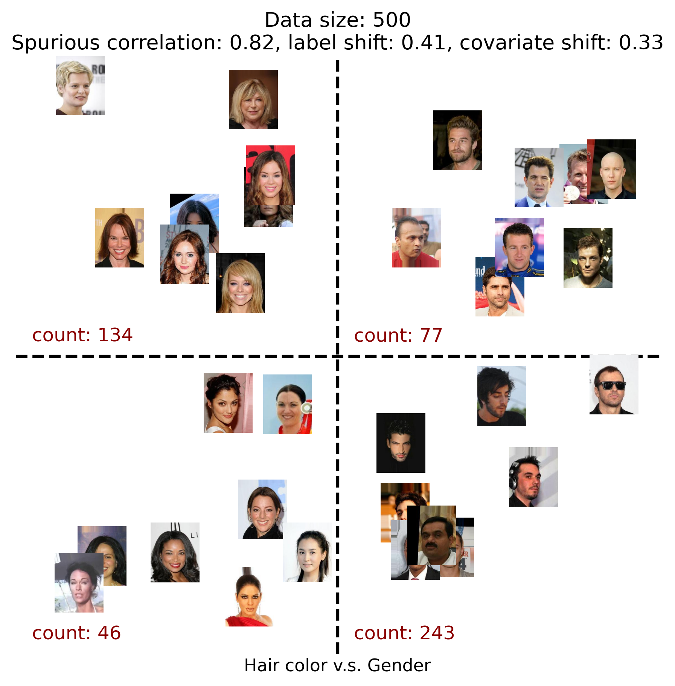

<h1 align="left"> OOD-Chameleon: Is Algorithm Selection for OOD Generalization Learnable?</h1>

[Liangze Jiang](https://liangzejiang.github.io/), [Damien Teney](https://www.damienteney.info/) (EPFL, Idiap Research Institute)

This repo contains the official code for the *ICML 2025* paper "*OOD-Chameleon: Is Algorithm Selection for OOD Generalization Learnable?*". [`arXiv`](https://arxiv.org/abs/2410.02735) | [`BibTeX`](#bibliography)


## Summary

<p align="center">

</p>

- 🤯 Out-of-distribution (OOD) generalization is challenging because distribution shifts come in **combined types and magnitudes** and often require different algorithms to handle them effectively.
- 🤔 It is far from clear how to select the appropriate algorithm for a given dataset without trial and error, even for human experts.
- ❓ Can we achieve OOD generalization by **learning to predict the right algorithm** for the right dataset?
- 💡 We formulate algorithm selection as a **supervised learning task** and explore the feasibility of learning an algorithm selector (OOD-Chameleon).
- 🌈 OOD-Chameleon is trained with a diverse collection of datasets, each exhibiting different distribution shifts.
- 🔗 This allows it to learn patterns and make informed predictions about which methods would perform best in various scenarios.
- 🔧 Along with the approach, we release **a [tool](#constructing-distribution-shifts) to construct diverse distribution shifts** from existing fine-grained-annotated datasets.

## Usage

### Installation
Clone this repository, navigate to the root directory and install the required packages:
```
git clone https://github.com/LiangzeJiang/OOD-Chameleon.git
cd OOD-Chameleon
conda create -n chameleon python=3.9 -y
conda activate chameleon
conda install pytorch torchvision -c pytorch -y
pip install -r requirements.txt
```
### Data Preparation
1. Download the original datasets (e.g. CelebA, CivilComments, MetaShift, OfficeHome, etc.)
    ```
    python download_ori_data.py --datasets [DATA1, DATA2, ...] --data_path YOUR_PATH
    ```
2. Set your data path and output path in `configs/data_path.sh`
3. Prepare the meta-dataset by running:
   ```
   bash scripts/prepare_metadataset.sh
   ```
   which will (i) generate tasks with diverse distribution shifts from the downloaded datasets, (ii) extract the dataset descriptors for each, and (iii) evaluate the performance of each algorithm on each task. 
   - The configurations for each dataset is specified in `configs/`.
   - `shifts_generator.py` generates the tasks given a configuration.
   - `dataset_descriptor.py` extracts the dataset descriptors for each generated task.
   - `train.py` evaluates the performance of each algorithm on each task.

    All these intermediate outputs will be saved in the `OUTPUT_DIR` you set in step 2.
### Training

Training and evaluation on the algorithm selection task is done in `train_chameleon.ipynb`. Please refer to the notebook for details.

## Constructing Distribution Shifts
A crucial step in our approach is (1) to generate diverse tasks with **diverse distribution shifts** that can be used to train the algorithm selector, and (2) to evaluate the performance of the algorithm selector on many other unseen tasks.
We propose (in `Section 3` of the paper) a tool to generate such tasks by resampling existing fine-grained-annotated datasets (e.g. CelebA, CivilComments, etc.)

The `TaskGenerator` in [`shifts_generator.py`](shifts_generator.py) does the above. It takes as input
-  the metadata file of the dataset (which describes the annotation `id`|`label`|`attribute` for each sample, e.g., `id`|`haircolor`|`gender` for CelebA), 
-  the desired types and magnitudes of distribution shifts (including *spurious correlations*, *covariate shift*, and *label shift*),
-  and the desired data size,

then outputs the `id` of the samples which collectively form a dataset that satisfies the above constraints. 

See below for two example datasets generated by the tool (note the 'count' of each group). You can use [`scripts/example_tasks.ipynb`](scripts/example_tasks.ipynb) to visualize more.

<p align="center">
  
  
</p>

## TODOs
- [ ] code for synthetic experiments

## Bibliography
If you find this repository helpful for your project, please cite our work:

```
@article{jiang2024ood,
  title={OOD-Chameleon: Is Algorithm Selection for OOD Generalization Learnable?},
  author={Jiang, Liangze and Teney, Damien},
  journal={arXiv preprint arXiv:2410.02735},
  year={2024}
}